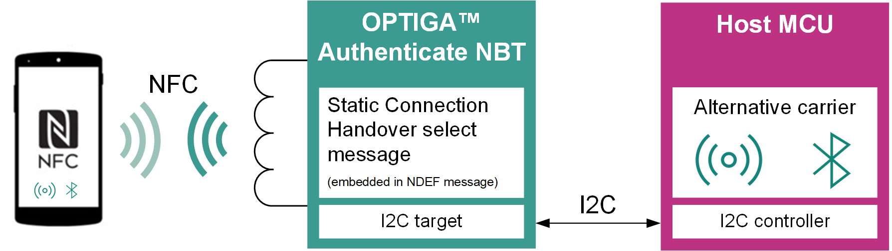
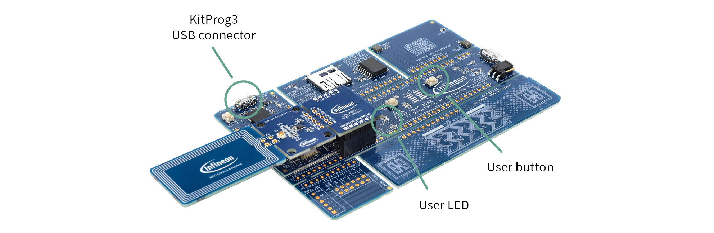

# OPTIGA&trade; Authenticate NBT SCH Application for ModusToolbox&trade;

This code example contains the *NBT Static Connection Handover* embedded application, a ModusToolbox&trade; project which showcases the OPTIGA&trade; Authenticate NBT in the static connection handover (SCH) use case.

The simple example showcases how to leverage the NFC Data Exchange Format (NDEF) functionality of the OPTIGA&trade; Authenticate NBT to enable a Bluetooth&reg; connection handover via the NFC interface.
The example targets the [PSOC&trade; 62S2 Wi-Fi Bluetooth&reg; Prototyping Kit](https://www.infineon.com/CY8CPROTO-062S2-43439) that is included in the [OPTIGA&trade; Authenticate NBT Development Kit](https://www.infineon.com/OPTIGA-Authenticate-NBT-Dev-Kit) as host microcontroller board. However, the example can be easily ported to any other I2C- and Bluetooth&reg;-enabled microcontroller supported by the ModusToolbox&trade;. The example is intended for the evaluation of the static connection handover use case alongside an Android mobile phone. No dedicated mobile phone application is needed since Android comes with the built-in functionality to support connection handover via NFC.

The OPTIGA&trade; Authenticate NBT can be personalized for static connection handover use case via both the I2C and the NFC interface. However, in combination with this embedded example application, the personalization is only feasible via the host microcontroller's I2C interface, since the host board's Bluetooth&reg; address is generated during runtime. The functionality for the personalization via I2C is included in this ModusToolbox&trade; example and is performed automatically at startup.
Yet, the *NBT Personalization* mobile phone app ([Android](https://github.com/Infineon/optiga-nbt-example-perso-android) or [iOS](https://github.com/Infineon/optiga-nbt-example-perso-ios)) is still suitable for personalizing the OPTIGA&trade; Authenticate NBT for other custom applications in static connection handover use cases.

See the [OPTIGA&trade; Authenticate NBT - GitHub overview](https://github.com/Infineon/optiga-nbt) repository for an overview of the available host software for the OPTIGA&trade; Authenticate NBT. The [OPTIGA&trade; Authenticate NBT - product page](https://www.infineon.com/OPTIGA-Authenticate-NBT) includes a dedicated guide for this use case with detailed information about the OPTIGA&trade; Authenticate NBT's static connection handover functionality.

**Figure 1. Evaluation setup for the static connection handover use case**



> **Note:** This project is licensed under MIT license. See the [LICENSE](LICENSE) file for details.

[View this README on GitHub.](https://github.com/Infineon/mtb-example-optiga-nbt-sch)

[Provide feedback on this code example.](https://cypress.co1.qualtrics.com/jfe/form/SV_1NTns53sK2yiljn?Q_EED=eyJVbmlxdWUgRG9jIElkIjoiQ0UyMzk1ODIiLCJTcGVjIE51bWJlciI6IjAwMi0zOTU4MiIsIkRvYyBUaXRsZSI6Ik9QVElHQSZ0cmFkZTsgQXV0aGVudGljYXRlIE5CVCBTQ0ggQXBwbGljYXRpb24gZm9yIE1vZHVzVG9vbGJveCZ0cmFkZTsiLCJyaWQiOiJuYWlrcm9oYW5iYWIiLCJEb2MgdmVyc2lvbiI6IjEuMS4wIiwiRG9jIExhbmd1YWdlIjoiRW5nbGlzaCIsIkRvYyBEaXZpc2lvbiI6Ik4vQSIsIkRvYyBCVSI6Ik4vQSIsIkRvYyBGYW1pbHkiOiJOL0EifQ==)


## Requirements

- [ModusToolbox&trade;](https://www.infineon.com/modustoolbox) v3.0 or later (tested with v3.4)
- Board support package (BSP) minimum required version: 4.2.0
- Programming language: C
- Associated parts:
  - [OPTIGA&trade; Authenticate NBT Development Kit](https://www.infineon.com/OPTIGA-Authenticate-NBT-Dev-Kit), including:
    - [PSOC&trade; 62S2 Wi-Fi Bluetooth&reg; Prototyping Kit](https://www.infineon.com/CY8CPROTO-062S2-43439)
    - [OPTIGA&trade; Authenticate NBT Development Shield](https://www.infineon.com/OPTIGA-Authenticate-NBT-Dev-Shield)
  - *NBT Pass-Through* embedded application ([ModusToolbox&trade;](https://github.com/Infineon/mtb-example-optiga-nbt-pt))
     > **Note:** Refers to this code example.


## Supported toolchains (make variable 'TOOLCHAIN')

- GNU Arm&reg; Embedded Compiler v11.3.1 (`GCC_ARM`) – Default value of `TOOLCHAIN`
- Arm&reg; Compiler v6.16 (`ARM`)
- IAR C/C++ Compiler v9.1 (`IAR`)


## Supported kits (make variable 'TARGET')

- [PSOC&trade; 62S2 Wi-Fi Bluetooth&reg; Prototyping Kit](https://www.infineon.com/CY8CPROTO-062S2-43439) (`CY8CPROTO-062S2-43439`) – Default value of `TARGET`


## Hardware setup

Assemble the OPTIGA&trade; Authenticate NBT Development Kit's components correctly to evaluate the static connection handover use case with the associated example applications. The following figure shows how to connect the OPTIGA&trade; Authenticate NBT Development Shield to the host microcontroller board (CY8CPROTO-062S2-43439). See the kit's user guide on its [product page](https://www.infineon.com/OPTIGA-Authenticate-NBT-Dev-Kit) for more information about the setup and alternative usage configurations.

**Figure 2. OPTIGA&trade; Authenticate NBT Development Kit setup**




**Table 1. Pin mapping between the OPTIGA&trade; Authenticate NBT Development Shield and the PSOC&trade; 6 MCU**

OPTIGA&trade; Authenticate NBT Development Shield  | CY8CPROTO-062S2-43439 | Function
--------------------- | -------------------  | -----
SDA | P6.1 (CYBSP_I2C_SDA) | I2C data
SCL | P6.0 (CYBSP_I2C_SCL) | I2C clock
IRQ | P6.2 | Interrupt
3V3 | VDD | Power and pad supply (3V3)
GND | GND | Common ground reference

<br>


## Software setup

See the [ModusToolbox&trade; tools package installation guide](https://www.infineon.com/ModusToolboxInstallguide) for information about installing and configuring the tools package.

Install a terminal emulator if you don't have one. Instructions in this document use [Tera Term](https://teratermproject.github.io/index-en.html).


## Using the code example

> **Warning**: Due to [Windows API's maximum path length limitation](https://learn.microsoft.com/en-us/windows/win32/fileio/maximum-file-path-limitation), which is 260 characters, the code example might fail during build with a "No such file or directory" error due to many submodules added to the project. In such cases, shorten the system path of the project to a minimum; e.g., move it to a different location.


### Create the project

The ModusToolbox&trade; tools package provides the Project Creator as both a GUI tool and a command line tool.

<details><summary><b>Use Project Creator GUI</b></summary>

1. Open the Project Creator GUI tool.

   There are several ways to do this, including launching it from the dashboard or from inside the Eclipse IDE. For more details, see the [Project Creator user guide](https://www.infineon.com/ModusToolboxProjectCreator) (locally available at *{ModusToolbox&trade; install directory}/tools_{version}/project-creator/docs/project-creator.pdf*).

2. On the **Choose Board Support Package (BSP)** page, select a kit supported by this code example. See [Supported kits](#supported-kits-make-variable-target).

   > **Note:** To use this code example for a kit not listed here, you may need to update the source files. If the kit does not have the required resources, the application may not work.

3. On the **Select Application** page:

   a. Select the **Applications(s) Root Path** and the **Target IDE**.

   > **Note:** Depending on how you open the Project Creator tool, these fields may be pre-selected for you.

   b.	Select this code example from the list by enabling its check box.

   > **Note:** You can narrow the list of displayed examples by typing in the filter box.

   c. (Optional) Change the suggested **New Application Name** and **New BSP Name**.

   d. Click **Create** to complete the application creation process.

</details>

<details><summary><b>Use Project Creator CLI</b></summary>

The 'project-creator-cli' tool can be used to create applications from a CLI terminal or from within batch files or shell scripts. This tool is available in the *{ModusToolbox&trade; install directory}/tools_{version}/project-creator/* directory.

Use a CLI terminal to invoke the 'project-creator-cli' tool. On Windows, use the command-line 'modus-shell' program provided in the ModusToolbox&trade; installation instead of a standard Windows command-line application. This shell provides access to all ModusToolbox&trade; tools. You can access it by typing "modus-shell" in the search box in the Windows menu. In Linux and macOS, you can use any terminal application.

The following example clones the [mtb-example-optiga-nbt-sch](https://github.com/Infineon/mtb-example-optiga-nbt-sch) application with the desired name "OptigaNbtSch" configured for the *CY8CPROTO-062S2-43439* BSP into the specified working directory, *C:/mtb_projects*:

   ```
   project-creator-cli --board-id CY8CPROTO-062S2-43439 --app-id mtb-example-optiga-nbt-sch --user-app-name OptigaNbtSch --target-dir "C:/mtb_projects"
   ```

The 'project-creator-cli' tool has the following arguments:

Argument | Description | Required/optional
---------|-------------|-----------
`--board-id` | Defined in the <id> field of the [BSP](https://github.com/Infineon?q=bsp-manifest&type=&language=&sort=) manifest | Required
`--app-id`   | Defined in the <id> field of the [CE](https://github.com/Infineon?q=ce-manifest&type=&language=&sort=) manifest | Required
`--target-dir`| Specify the directory in which the application is to be created if you prefer not to use the default current working directory | Optional
`--user-app-name`| Specify the name of the application if you prefer to have a name other than the example's default name | Optional

<br>

> **Note:** The project-creator-cli tool uses the `git clone` and `make getlibs` commands to fetch the repository and import the required libraries. For details, see the "Project creator tools" section of the [ModusToolbox&trade; tools package user guide](https://www.infineon.com/ModusToolboxUserGuide) (locally available at {ModusToolbox&trade; install directory}/docs_{version}/mtb_user_guide.pdf).

</details>


### Open the project

After the project has been created, you can open it in your preferred development environment.


<details><summary><b>Eclipse IDE</b></summary>

If you opened the Project Creator tool from the included Eclipse IDE, the project will open in Eclipse automatically.

For more details, see the [Eclipse IDE for ModusToolbox&trade; user guide](https://www.infineon.com/MTBEclipseIDEUserGuide) (locally available at *{ModusToolbox&trade; install directory}/docs_{version}/mt_ide_user_guide.pdf*).

</details>


<details><summary><b>Visual Studio (VS) Code</b></summary>

Launch VS Code manually, and then open the generated *{project-name}.code-workspace* file located in the project directory.

For more details, see the [Visual Studio Code for ModusToolbox&trade; user guide](https://www.infineon.com/MTBVSCodeUserGuide) (locally available at *{ModusToolbox&trade; install directory}/docs_{version}/mt_vscode_user_guide.pdf*).

</details>


<details><summary><b>Keil µVision</b></summary>

Double-click the generated *{project-name}.cprj* file to launch the Keil µVision IDE.

For more details, see the [Keil µVision for ModusToolbox&trade; user guide](https://www.infineon.com/MTBuVisionUserGuide) (locally available at *{ModusToolbox&trade; install directory}/docs_{version}/mt_uvision_user_guide.pdf*).

</details>


<details><summary><b>IAR Embedded Workbench</b></summary>

Open IAR Embedded Workbench manually, and create a new project. Then select the generated *{project-name}.ipcf* file located in the project directory.

For more details, see the [IAR Embedded Workbench for ModusToolbox&trade; user guide](https://www.infineon.com/MTBIARUserGuide) (locally available at *{ModusToolbox&trade; install directory}/docs_{version}/mt_iar_user_guide.pdf*).

</details>


<details><summary><b>Command line</b></summary>

If you prefer to use the CLI, open the appropriate terminal, and navigate to the project directory. On Windows, use the command-line 'modus-shell' program; on Linux and macOS, you can use any terminal application. From there, you can run various `make` commands.

For more details, see the [ModusToolbox&trade; tools package user guide](https://www.infineon.com/ModusToolboxUserGuide) (locally available at *{ModusToolbox&trade; install directory}/docs_{version}/mtb_user_guide.pdf*).

</details>


## Operation


### Connect the OPTIGA&trade; Authenticate NBT Development Shield to the PSOC&trade; 6 host board

1. Connect the shield to the [PSOC&trade; 62S2 Wi-Fi Bluetooth&reg; Prototyping Kit](https://www.infineon.com/CY8CPROTO-062S2-43439) host microcontroller board as described in the [Hardware setup](#hardware-setup) section.


### Personalize the OPTIGA&trade; Authenticate NBT device

1. The OPTIGA&trade; Authenticate NBT is automatically personalized by the PSOC&trade; microcontroller during its startup. The exact personalization routine is defined in this ModusToolbox&trade; example application.

> **Note:** Personalization via NFC is not feasible for this example application. 


### Program the board

1. Connect the board to your PC using the provided USB cable through the KitProg3 USB connector.

2. Program the board using one of the following (you do not need any extra configuration for the first part):

   <details><summary><b>Using Eclipse IDE</b></summary>

      1. Select the application project in the Project Explorer.

      2. In the **Quick Panel**, scroll down, and click **\<Application Name> Program (KitProg3_MiniProg4)**.
   </details>


   <details><summary><b>In other IDEs</b></summary>

   Follow the instructions in your preferred IDE.
   </details>


   <details><summary><b>Using CLI</b></summary>

     From the terminal, execute the `make program` command to build and program the application using the default toolchain to the default target. The default toolchain is specified in the application's Makefile but you can override this value manually:
      ```
      make program TOOLCHAIN=<toolchain>
      ```

      Example:
      ```
      make program TOOLCHAIN=GCC_ARM
      ```
   </details>


### Connect and use

1. Turn on both the Bluetooth&reg; and the NFC interface on the device to pair via Bluetooth&reg; and read the NDEF Bluetooth&reg; LE record from the OPTIGA&trade; Authenticate NBT. This lets you pair with the host (PSOC&trade; board) by tapping your device to the OPTIGA&trade; Authenticate NBT Development Shield's antenna.

2. Follow the prompts on your device to establish the Bluetooth&reg; connection.

3. After the Bluetooth&reg; connection has been established, press the PSOC&trade; board's user button to send an [HID](https://www.hidglobal.com/) `Mute` command to mute or unmute your device's volume.


### (Optional) Disconnect

1. Disconnect and unpair the device from the peer client via its Bluetooth&reg; settings menu.

2. Press and hold the PSOC&trade; board's user button for more than five seconds to erase the Bluetooth&reg; bonding information on PSOC&trade; device. This sets the PSOC&trade; device to its initial state and new devices can connect using the method described above.


## Debugging

You can debug the example to step through the code.


<details><summary><b>In Eclipse IDE</b></summary>

Use the **\<Application Name> Debug (KitProg3_MiniProg4)** configuration in the **Quick Panel**. For details, see the "Program and debug" section in the [Eclipse IDE for ModusToolbox&trade; user guide](https://www.infineon.com/MTBEclipseIDEUserGuide).


> **Note:** **(Only while debugging)** On the CM4 CPU, some code in `main()` may execute before the debugger halts at the beginning of `main()`. This means that some code executes twice – once before the debugger stops execution, and again after the debugger resets the program counter to the beginning of `main()`. See [KBA231071](https://community.infineon.com/docs/DOC-21143) to learn about this and for the workaround.

</details>


<details><summary><b>In other IDEs</b></summary>

Follow the instructions in your preferred IDE.

</details>


## Design and implementation

On startup, the NBT abstraction will be set up before starting the FreeRTOS. Once the abstraction is configured, the `startup_task` starts configuring OPTIGA&trade; Authenticate NBT and the Bluetooth&reg; stack, and starts the application logic.

The application will:
   1. Configure the OPTIGA&trade; Authenticate NBT for the static connection handover use case via `nbt_configure_ch()`.
   2. Start up the Bluetooth&reg; LE stack for the HID service.
   3. Once the Bluetooth&reg; stack is initialized, generate a unique MAC address based on the unique die identifier (in *bluetooth-handling.c#ble_callback*) of the PSOC&trade;.
   4. Generate the "Bluetooth&reg; Secure Simple Pairing Using NFC" message based on the dynamically generated out-of-band data (in *bluetooth-handling.c#ble_callback*).
   5. Update the connection handover record in OPTIGA&trade; Authenticate NBT's NDEF file via `nbt_write_file()`.
   6. Continue with the normal execution of the HID over Bluetooth&reg; LE service.


### Customization

Besides the customization available via the [OPTIGA&trade; Authenticate NBT ModusToolbox&trade; library](https://github.com/Infineon/optiga-nbt-lib-c-mtb), you can build your own application logic by adapting the Bluetooth&reg; LE handler in the *bluetooth-handling.c* file.

If you want to write your own FreeRTOS tasks based on the WICED Bluetooth&reg; stack, do the following:

  * Disable the **Resolvable Private Address** Bluetooth&reg; LE feature. To write the MAC to NBT, it needs to be public, static, and unique for each device.
    Open the ModusToolbox&trade; *Bluetooth&reg; Configurator* (e.g., by opening this project's *design.cybt*) file.
	In the **GAP Settings** tab, disable the  **Enable RPA timeout** setting.

  * Generate a unique MAC address for your device.
    You can use code similar to the following:

	```
	wiced_bt_device_address_t local_bda = { 0x00 };
    memcpy(local_bda, cy_bt_device_address, sizeof(wiced_bt_device_address_t));
    uint64_t id = Cy_SysLib_GetUniqueId();
    local_bda[3] = (id >> CY_UNIQUE_ID_DIE_WAFER_Pos) & 0xFFU;
    local_bda[4] = (id >> CY_UNIQUE_ID_DIE_X_Pos) & 0xFFU;
    local_bda[5] = (id >> CY_UNIQUE_ID_DIE_Y_Pos) & 0xFFU;
	```

  * Once the Bluetooth&reg; module has been enabled (`BTM_ENABLED_EVT`), write the MAC address to the OPTIGA&trade; Authenticate NBT via `nbt_write_file()`.

  * Generate the out-of-band data required for the Bluetooth&reg; connection handover via `wiced_bt_smp_create_local_sc_oob_data()`.

  * Once the data is received (`BTM_SMP_SC_LOCAL_OOB_DATA_NOTIFICATION_EVT`), update the connection handover message according to the specification and write the data to the OPTIGA&trade; Authenticate NBT via `nbt_write_file()`.


## Related resources

Resources  | Links
-----------|----------------------------------
Application notes  | [AN228571](https://www.infineon.com/AN228571) – Getting started with PSOC&trade; 6 MCU on ModusToolbox&trade; software
Code examples  | [Using ModusToolbox&trade;](https://github.com/Infineon/Code-Examples-for-ModusToolbox-Software) on GitHub
Device documentation | [PSOC&trade; 6 MCU datasheets](https://documentation.infineon.com/html/psoc6/bnm1651211483724.html) <br> [PSOC&trade; 6 technical reference manuals](https://documentation.infineon.com/html/psoc6/zrs1651212645947.html)
Development kits | Select your kits from the [Evaluation board finder](https://www.infineon.com/cms/en/design-support/finder-selection-tools/product-finder/evaluation-board).
Libraries on GitHub  | [mtb-pdl-cat1](https://github.com/Infineon/mtb-pdl-cat1) – PSOC&trade; 6 Peripheral Driver Library (PDL)  <br> [mtb-hal-cat1](https://github.com/Infineon/mtb-hal-cat1) – Hardware Abstraction Layer (HAL) library <br> [retarget-io](https://github.com/Infineon/retarget-io) – Utility library to retarget STDIO messages to a UART port <br> [freertos](https://github.com/Infineon/freertos) – FreeRTOS for Infineon MCUs <br> [optiga-nbt-lib-c-mtb](https://github.com/Infineon/optiga-nbt-lib-c-mtb) – OPTIGA&trade; Authenticate NBT Host Library for ModusToolbox&trade;
Middleware on GitHub  | [psoc6-middleware](https://github.com/Infineon/modustoolbox-software#psoc-6-middleware-libraries) – Links to all PSOC&trade; 6 MCU middleware
OPTIGA&trade; Authenticate NBT  | [OPTIGA&trade; Authenticate NBT - product page](https://www.infineon.com/OPTIGA-Authenticate-NBT) <br>[OPTIGA&trade; Authenticate NBT - GitHub overview](https://github.com/Infineon/optiga-nbt) <br> [OPTIGA&trade; Authenticate NBT Development Kit - product page](https://www.infineon.com/OPTIGA-Authenticate-NBT-Dev-Kit) 
Tools  | [ModusToolbox&trade;](https://www.infineon.com/modustoolbox) – ModusToolbox&trade; software is a collection of easy-to-use libraries and tools enabling rapid development with Infineon MCUs for applications ranging from wireless and cloud-connected systems, edge AI/ML, embedded sense and control, to wired USB connectivity using PSOC&trade; Industrial/IoT MCUs, AIROC&trade; Wi-Fi and Bluetooth&reg; connectivity devices, XMC&trade; Industrial MCUs, and EZ-USB&trade;/EZ-PD&trade; wired connectivity controllers. ModusToolbox&trade; incorporates a comprehensive set of BSPs, HAL, libraries, configuration tools, and provides support for industry-standard IDEs to fast-track your embedded application development.

<br>


## Other resources

Infineon provides a wealth of data at [www.infineon.com](https://www.infineon.com) to help you select the right device, and quickly and effectively integrate it into your design.


## Document history

Document title: *CE239582* – *OPTIGA&trade; Authenticate NBT SCH Application for ModusToolbox&trade;*

 Version | Description of change
 ------- | ---------------------
 1.0.0   | New code example
 1.1.0   | Added support for ModusToolbox&trade; software v3.4 <br> Updated optiga-nbt-lib-c-mtb to v1.1.2
<br>

All referenced product or service names and trademarks are the property of their respective owners.

The Bluetooth&reg; word mark and logos are registered trademarks owned by Bluetooth SIG, Inc., and any use of such marks by Infineon is under license.


---------------------------------------------------------

© Cypress Semiconductor Corporation, 2024-2025. This document is the property of Cypress Semiconductor Corporation, an Infineon Technologies company, and its affiliates ("Cypress").  This document, including any software or firmware included or referenced in this document ("Software"), is owned by Cypress under the intellectual property laws and treaties of the United States and other countries worldwide.  Cypress reserves all rights under such laws and treaties and does not, except as specifically stated in this paragraph, grant any license under its patents, copyrights, trademarks, or other intellectual property rights.  If the Software is not accompanied by a license agreement and you do not otherwise have a written agreement with Cypress governing the use of the Software, then Cypress hereby grants you a personal, non-exclusive, nontransferable license (without the right to sublicense) (1) under its copyright rights in the Software (a) for Software provided in source code form, to modify and reproduce the Software solely for use with Cypress hardware products, only internally within your organization, and (b) to distribute the Software in binary code form externally to end users (either directly or indirectly through resellers and distributors), solely for use on Cypress hardware product units, and (2) under those claims of Cypress's patents that are infringed by the Software (as provided by Cypress, unmodified) to make, use, distribute, and import the Software solely for use with Cypress hardware products.  Any other use, reproduction, modification, translation, or compilation of the Software is prohibited.
<br>
TO THE EXTENT PERMITTED BY APPLICABLE LAW, CYPRESS MAKES NO WARRANTY OF ANY KIND, EXPRESS OR IMPLIED, WITH REGARD TO THIS DOCUMENT OR ANY SOFTWARE OR ACCOMPANYING HARDWARE, INCLUDING, BUT NOT LIMITED TO, THE IMPLIED WARRANTIES OF MERCHANTABILITY AND FITNESS FOR A PARTICULAR PURPOSE.  No computing device can be absolutely secure.  Therefore, despite security measures implemented in Cypress hardware or software products, Cypress shall have no liability arising out of any security breach, such as unauthorized access to or use of a Cypress product. CYPRESS DOES NOT REPRESENT, WARRANT, OR GUARANTEE THAT CYPRESS PRODUCTS, OR SYSTEMS CREATED USING CYPRESS PRODUCTS, WILL BE FREE FROM CORRUPTION, ATTACK, VIRUSES, INTERFERENCE, HACKING, DATA LOSS OR THEFT, OR OTHER SECURITY INTRUSION (collectively, "Security Breach").  Cypress disclaims any liability relating to any Security Breach, and you shall and hereby do release Cypress from any claim, damage, or other liability arising from any Security Breach.  In addition, the products described in these materials may contain design defects or errors known as errata which may cause the product to deviate from published specifications. To the extent permitted by applicable law, Cypress reserves the right to make changes to this document without further notice. Cypress does not assume any liability arising out of the application or use of any product or circuit described in this document. Any information provided in this document, including any sample design information or programming code, is provided only for reference purposes.  It is the responsibility of the user of this document to properly design, program, and test the functionality and safety of any application made of this information and any resulting product.  "High-Risk Device" means any device or system whose failure could cause personal injury, death, or property damage.  Examples of High-Risk Devices are weapons, nuclear installations, surgical implants, and other medical devices.  "Critical Component" means any component of a High-Risk Device whose failure to perform can be reasonably expected to cause, directly or indirectly, the failure of the High-Risk Device, or to affect its safety or effectiveness.  Cypress is not liable, in whole or in part, and you shall and hereby do release Cypress from any claim, damage, or other liability arising from any use of a Cypress product as a Critical Component in a High-Risk Device. You shall indemnify and hold Cypress, including its affiliates, and its directors, officers, employees, agents, distributors, and assigns harmless from and against all claims, costs, damages, and expenses, arising out of any claim, including claims for product liability, personal injury or death, or property damage arising from any use of a Cypress product as a Critical Component in a High-Risk Device. Cypress products are not intended or authorized for use as a Critical Component in any High-Risk Device except to the limited extent that (i) Cypress's published data sheet for the product explicitly states Cypress has qualified the product for use in a specific High-Risk Device, or (ii) Cypress has given you advance written authorization to use the product as a Critical Component in the specific High-Risk Device and you have signed a separate indemnification agreement.
<br>
Cypress, the Cypress logo, and combinations thereof, ModusToolbox, PSoC, CAPSENSE, EZ-USB, F-RAM, and TRAVEO are trademarks or registered trademarks of Cypress or a subsidiary of Cypress in the United States or in other countries. For a more complete list of Cypress trademarks, visit www.infineon.com. Other names and brands may be claimed as property of their respective owners.